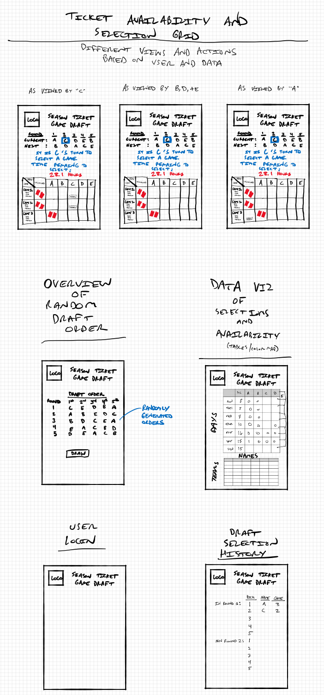

# ticketDraft
A web app to draft game tickets amongst a group sharing season tickets to sporting events.

## Release Info
**Author**: Paul Leonard
**Version**: 0.1.0

## Overview
Friends often group together to share expensive season ticket packages to their favorite sports teams.  While this arrangement can help reduce the individual cost and guarantee access to some games at the ticket face value, determining who gets tickets to which games can prove difficult.

This web app offers a fair way to disseminate games to each of the group members.  The program generates a random (with reversing snake) drafting order and presides over the draft ensuring each person only picks a game to attend when it is their turn.  The database stores the full season for the team and keeps track of which member of the group is attending which game.  Each member of the group can review who has claimed which game, which games are still available, the draft selection order, and whose turn it is.

## Architecture
A Dockerized Django backend created with DjangoX and Django REST framework, hosted on Heroku supported by a postgreSQL database at ElephantSQL, serves a RESTful API to an interactive and stateful Next.js React JavaScript frontend hosted at Vercel.

## Change Log
**0.1.0** 9-8-2021 - Initial creation

## API Endpoint Documentation on Postman
https://documenter.getpostman.com/view/13129407/TW6tKVDm#auth-info-d671fae6-7e1a-4ce0-b975-f72b897ba422

## Credits and Collaborations
- The initial version of this frontend website will consume a backend API created by Team getKraken.  The team created a Dockerized Django backend hosted on Heroku supported by postgreSQL database at ElephantSQL to serve a RESTful API as part of their final project at Code Fellows.  The team was comprised of Mark Bell, Will Ulrich Motchoffo, Yonatan Palagashvili, and Paul Leonard.  The full repo is available at https://github.com/getKraken/getKraken.

## User Stories
|	User	|	Task	|	Story	|
|	:---:	|	:---:	|	:---:	|
|	Member	|	Sign Up	|	I would like to join as a Member to utilize the service.	|
|	Member	|	Log In	|	I would like to authenticate myself so I can view data pertient to me.	|
|	Member	|	See Series you are a part of	|	I woulc like to see a list of all of the Series I am a part of.	|
|	Member	|	See all of the Games in a Series	|	I would like to view all of the Games within a Series.	|
|	Member	|	See my Games in a Series	|	I would like to view all of the Games I have claimed within a given Series.	|
|	Member	|	Claim a game	|	I would like to claim a Game as mine.	|
|	Member	|	See the draft order	|	I would like to view the draft order and current turn for situational awareness and decision prep.	|
|	Series Owner	|	Create Series	|	As a season ticket owner, I would like to create a Series to capture all the games of the season.	|
|	Series Owner	|	Add Game	|	I would like to add games to my season.	|
|	Series Owner	|	Remove Game	|	I would like to remove a cancelled game.	|
|	Series Owner	|	Add Members	|	I would like to share my season tickets with other Members.	|
|	Series Owner	|	Generate the draft	|	I would like to kick off a draft sequence that will include random orders for each Member's picks.	|
|	Developer	|	Testing	|	I would like to run tests to make sure things are working.	|
|	Developer	|	Automated testing	|	I would like the tests to run automatically to ensure through and frequent testing.	|
|	Developer	|	Postman API Documentation	|	I would like to be able to see documentation to easily understand the API.	|
						
	[^1]:  Note that Series Owner is also a Member					

## Wireframes (layout sketches)

## Future Features
| Status |	Feature Title	|	Priority	|	Feature Description	|
| :---: |	:---:	|	:---:	|	:---:	|
| [ ] |	React Frontend	|	1	|	React frontend to update game status without refreshing page	|
| [ ] |	Consume Existing Django RESTful APIs	|	1	|	Use the previously developed Django backend RESTful APIs (group project)	|
| [ ] |	Add Manual Games	|	1	|	Basic game addition for first version	|
| [ ] |	Claim Games	|	1	|	Have a button for Members to claim 	|
| [ ] |	Validate Claims	|	1	|	Is the game available to claim?  Is it the Member's turn?	|
| [ ] |	Sign Up Page	|	1	|	Create a new account as a Member	|
| [ ] |	Login Page	|	1	|	Ability to login	|
| [ ] |	Add Members Page	|	1	|	After a Series Owner creates a Series, they can add Members to it	|
| [ ] |	Create Series Page	|	1	|	A Member can create a new Series	|
| [ ] |	Series Page	|	1	|	Displays all of the games within a Series and the active draft	|
| [ ] |	Create Random Draft Order	|	1	|	Function to create the random draft for each odd numbered round	|
| [ ] |	Reverse Draft Order	|	1	|	For each even numbered round, reverse the previous round's order	|
| [ ] |	Authorization and Authentication	|	1	|	Require user accounts for action validation	|
| [ ] |	CSS Improvements	|	1	|	Improve design, use team colors, readability, accessibility	|
| [ ] |	Redesign the Django Backend	|	2	|	Django framework including functional views	|
| [ ] |	RESTful API	|	2	|	Define RESTful API interface between frontend and backend	|
| [ ] |	SQL DB	|	2	|	Set up postgreSQL database at ElephantSQL	|
| [ ] |	Docker	|	2	|	Containerized for multiple instances on the backend	|
| [ ] |	Pull Game Schedule from NHL API	|	3	|	Tie in to pull various teams schedules from the NHL API	|
| [ ] |	Game Details	|	4	|	Display game details from NHL	|
| [ ] |	Filter Your Games	|	5	|	Sorting feature buttons with All/Your/Unclaimed	|
| [ ] |	Filter Unclaimed Games	|	5	|	Sorting feature buttons with All/Your/Unclaimed	|
| [ ] |	Search for Games	|	6	|	Use Elastic Search to allow searching for a particular opponent or date	|
| [ ] |	Email Notifications	|	7	|	Email notifications when it is your turn to claim a game	|
| [ ] |	Twilio Notifications	|	8	|	Text notifications when it is your turn to claim a game	|
| [ ] |	Mark Game as Sold via a market	|	9	|	Mark that a game was sold to a different party using official market	|
| [ ] |	Mark Game as Sold to a friend	|	9	|	Mark that a game was sold to a different party on the side	|
| [ ] |	Mark Game as Transferred to Series Member	|	9	|	Mark that a game has been transferred to the person that claimed it	|
| [ ] |	Mark Game as Transferred to Buyer	|	9	|	Mark that a game has been transferred to a person who purchased it	|
| [ ] |	Compute Total Sold Stats	|	10	|	Compute overall sales stats to watch limits	|
| [ ] |	Compute Member Sold Stats	|	10	|	Compute individual sales stats to understand the share of sales	|
| [ ] |	Return a Claimed Ticket	|	11	|	Returned a claimed ticket if you decide you do not want that game	|
| [ ] |	Time Since Draft Turn Clock	|	12	|	Display a clock which shows elapsed time since it was a Member's turn	|
| [ ] |	Add Opponent Stats	|	13	|	Show stats such as individual record, forecast; goalie matchup	|
| [ ] |	Add Profile Pictures on S3	|	14	|	Use Amazon S3 server to have member pictures	|
| [ ] |	Add robots.txt	|	15	|	Add robots.txt to improve SEO	|
| [ ] |	Add Google Analytics	|	16	|	Add Google Analytics to the site to understand how people use it	|
| [ ] |	Create React Native App for mobile use	|	16	|	Create a mobile version of the app for on the go use	|
| [ ] |	Create Confirmation Pop Up for Claiming	|	17	|	Make claiming a game a two step operation to ensure intentionality	|
| [ ] |	Add Individual Seats for cross claims	|	18	|	Make individual seats claimable	|
| [ ] |	Create Claimed Animation	|	19	|	Use animations to bring excitement to claiming a game	|
| [ ] |	Rank Choices Pre-Draft	|	20	|	Offer a way for Member's to take notes about their drafting plans	|
| [ ] |	Auto-Draft	|	21	|	Use a Member's notes to automate their draft choices for them	|
| [ ] |	Trading Claimed Games Amongst Members 	|	22	|	Set up a function for trading games in side deals between Members	|
| [ ] |	Remove Member	|	23	|	Remove a Member who is no longer a part of the Series	|
| [ ] |	See Member's Games Across Series	|	24	|	A way for a Member to see all Games they claimed across all Series	|
| [ ] |	Third Party Login	|	25	|	Use Google or Facebook to login	|
| [ ] |	Stripe Payment for Donation	|	26	|	Accept payments via a third party	|

## Trello Board to Manage Tasks
https://trello.com/b/g5bLMfQS/kraken-draft-agile-board

## Sources
- [getKraken Repo](https://github.com/getKraken)
- [React](https://reactjs.org/)
- [Next.js](https://nextjs.org/)
